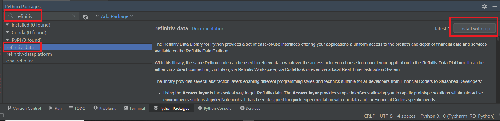
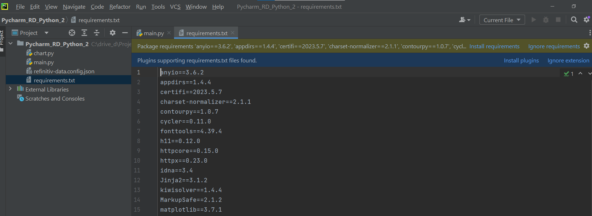
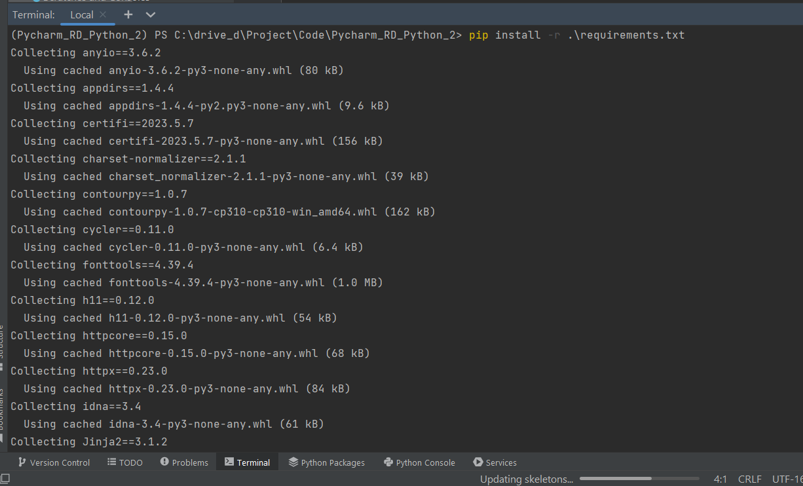

# How to set up Python Development Project with PyCharm

- version: 1.0.0
- Last update: June 2023
- Environment: Windows
- Compiler: Python
- Prerequisite: [Python and PyCharm prerequisite](#prerequisite)

## <a id="Introduction"></a>Introduction

[PyCharm](https://www.jetbrains.com/pycharm/) is a flagship cross-platform [Python](https://www.python.org/) IDE developed by [JetBrains](https://www.jetbrains.com/) (the same company that developed [IntelliJ IDEA](https://www.jetbrains.com/idea/) for [Java](https://openjdk.org/)/[Kotlin](https://kotlinlang.org/)). The IDE provides coding assistance such as code completion and syntax/error highlight, project and code navigation, package management, debugger, version control, and much more. 

PyCharm has two editions, a Professional Edition with full features, and a free Community Edition (see the [comparison](https://www.jetbrains.com/products/compare/?product=pycharm&product=pycharm-ce)), this makes the IDE attractive to both newbie and full-stack Python developers.

As a developer, I am using the [IntelliJ IDEA](https://www.jetbrains.com/idea/) for Java development projects and [Visual Studio Code](https://code.visualstudio.com/) editor for Python and JavaScript/TypeScript development projects. I admit that I am never interested in PyCharm. However, there are a lot of questions about how to use our Python APIs/libraries with PyCharm, so it is a good opportunity for me to learn how to use PyCharm and share my knowledge.

This example project shows how to create a Python project with the [Refinitiv Data Library for Python](https://developers.refinitiv.com/en/api-catalog/refinitiv-data-platform/refinitiv-data-library-for-python) on PyCharm. It covers from starting a blank project to importing existing source code and dependencies configuration file to the IDE. 

Note: This project is based on **PyCharm Community Edition 2023.1.2** and the **Classic UI**. If you are using a Professional Edition or New UI, some user interfaces may be different. 

## <a id="prerequisite"></a>Python and PyCharm prerequisite

Before I am going further, there is some prerequisite, dependencies, and libraries that the project is needed.

### PyCharm

Firstly, you can download (or purchase) the PyCharm IDE installer file from [PyCharm](https://www.jetbrains.com/pycharm/download) website. 

### Anaconda or Miniconda

Next, install the [Anaconda](https://www.anaconda.com/) or [Minconda](https://conda.io/en/latest/miniconda.html) in your machine. 

This project uses Miniconda version 23.3.1.

### Access to the Refinitiv Data Platform

This project uses Refinitiv Data Platform (RDP) User ID type credential (example: sample@lseg.com). 

Please contact your Refinitiv representative to help you with the RDP account and services.

### Internet Access to PyPI

The Refinitiv Data Library for Python is available in the Python Package Index ([PyPI](https://pypi.org/)). You can use the Python pip tool to download the library from [Refinitiv-Data package](https://pypi.org/project/refinitiv-data/) over internet. 

## <a id="whatis_rdp"></a>What is Refinitiv Data Library for Python?

Now let me turn to our example Python library for this project. The [Refinitiv Data Library for Python](https://developers.refinitiv.com/en/api-catalog/refinitiv-data-platform/refinitiv-data-library-for-python) (aka RD Lib - Python) provides a set of ease-of-use interfaces offering coders uniform access to the breadth and depth of financial data and services available on the Refinitiv Data Platform. The API is designed to provide consistent access through multiple access channels and target both Professional Developers and Financial Coders. Developers can choose to access content from the desktop, through their deployed streaming services, or directly to the cloud. With the Refinitiv Data Library, the same Python code can be used to retrieve data regardless of which access point you choose to connect to the platform.

This example project is focusing on the platform session which connecting to the [Refinitiv Data Platform APIs](https://developers.refinitiv.com/en/api-catalog/refinitiv-data-platform/refinitiv-data-platform-apis) only.  


For more detail regarding the Refinitiv Data Platform, please see the following APIs resources: 
- [Quick Start](https://developers.refinitiv.com/en/api-catalog/refinitiv-data-platform/refinitiv-data-library-for-python/quick-start) page.
- [Tutorials](https://developers.refinitiv.com/en/api-catalog/refinitiv-data-platform/refinitiv-data-library-for-python/tutorials) page.

## <a id="new_project"></a>Set up a blank project

### Step 1: Creating a new project

Firstly, create a new development project. Please open the PyCharm IDE and choose "New Project" on the welcome screen.


Next, input the project location (I pick *C:\drive_d\Project\Code\Pycharm_RD_Python* folder as my work location) and set the following properties:
- *New environment using*: Conda
- *Location*: Point to your &lt;Conda&gt;\envs\\&lt;Project name&gt;
- *Python version*: Based on your preference, I choose Python 3.10. Please refer to the [Python End Of Life page](https://endoflife.date/python)
- *Conda executable*: Point to &lt;Conda&gt;\Script\conda.exe location in your Conda installation folder
- *Create a main.py welcome script*: Choose this option


Note: PyCharm supports the [Virtualenv](https://virtualenv.pypa.io/en/latest/), [Pipenv](https://pipenv.pypa.io/en/latest/), [Poetry](https://python-poetry.org/), and [Anaconda](https://www.anaconda.com/)/[Minconda](https://conda.io/en/latest/miniconda.html) Python virtual environment and Packaging/Dependencies Management tools. I choose Conda for Python versioning flexibility. Please choose this option based on your development requirement.

Then PyCharm initializes the project and Conda environment.


Once the project and Conda environment are created successfully, you see this IDE screen with an example ```main.py``` code as follows:


You can use this example ```main.py``` script to test if PyCharm can run Python properly on your machine. To run the code, right-click and choose Run 'Main' menu or click the Run command at the toolbar.


The result is as follows:


### Step 2: Set up the Project setting for Refinitiv Data Library for Python

The next step is installing the Refinitiv Data Library for Python dependencies. Firstly, open the Python Package tool window available at the bottom of the screen as follows:


You can start typing the package name in the Search field. PyCharm then shows matching packages on each repository. Since we are using a Conda environment, so PyCharm shows search results on both Conda and PyPI repositories like the following search result for the *python-dotenv* package.


To install Refinitiv Data Library for Python, type **refinitiv** in the Search field. The RD Lib - Python is available on PyPI only, so I choose the **refinitiv-data** package under PyPI and click the "Install with pip" button to install the package.



Once the package installation is successful, you see the notification, and the **refinitiv-data** package is listed in the installed packages.


The next step is testing the RD Lib - Python. You can add the **refinitiv-data.config.json** file to the IDE with the following configurations:

``` JSON
{
    "logs": {
        "level": "debug",
        "transports": {
            "console": {
                "enabled": false
            },
            "file": {
                "enabled": false,
                "name": "refinitiv-data-lib.log"
            }
        }
    },
    "sessions": {
        "default": "platform.rdp",
        "platform": {
            "rdp": {
                "app-key": "App Key",
                "username": "RDP User ID",
                "password": "RDP Password"
            },
           
        }
       
    }
}
```

Please refer to the [Quickstart page](https://developers.refinitiv.com/en/api-catalog/refinitiv-data-platform/refinitiv-data-library-for-python/quick-start) if you are using other Access Points such as Desktop session, etc.

Next, change the code of ```main.py``` to call RD - Lib Python instead as follows:

``` Python

import json
import refinitiv.data as rd

if __name__ == '__main__':
    rd.open_session(name='platform.rdp')
    data = rd.get_data(['EUR=', 'THB='], fields=['BID', 'ASK'])
    print(data)

    rd.close_session()
```

Your PyCharm IDE should look like the following screenshot:


If your RDP credential works fine, the running result shows as follows:


Now your PyCharm is ready to work with Refinitiv Data Library for Python.

For more detail about packages management with PyCharm, please check the [official document](https://www.jetbrains.com/help/pycharm/installing-uninstalling-and-upgrading-packages.html).

### Step 3: Plotting Graph

Now we come to how to plot a graph with PyCharm. Please note that the [Jupyter Notebook integration](https://www.jetbrains.com/help/pycharm/jupyter-notebook-support.html) is available in PyCharm Professional Edition only, so I am demonstrating with a basic graph from a console application instead. 

The first step is to install the [Matplotlib](https://matplotlib.org/) library. You can open the Python Package tool window to install the package. However, the PyCharm has [Terminal emulator](https://www.jetbrains.com/help/pycharm/terminal-emulator.html#:~:text=PyCharm%20includes%20an%20embedded%20terminal,to%20a%20dedicated%20terminal%20application.) that run the project Conda (or Virtualenv) shell automatically and you can run the ```pip``` and ```conda``` commands to manage the Python environment directly.

To open the Terminal, just click the Terminal tool window at the bottom of the screen. You see that it activates Conda Pycharm_RDPython by default.


The Matplotlib library is available on both [conda-forge](https://anaconda.org/conda-forge/matplotlib) and [PyPI](https://pypi.org/project/matplotlib/), let's stick with the PyPI for consistency and install the package with the ```pip install``` command.

``` bash
(Pycharm_RD_Python) C:> pip install matplotlib
```


Next, add a new Python file ```chart.py``` to the IDE with the following source code.

Please see how to add Python files from [the official page](https://www.jetbrains.com/help/dataspell/populating-projects.html).

``` Python
import pandas as pd
import matplotlib.pyplot as plt
import refinitiv.data as rd
from refinitiv.data.content import historical_pricing
from refinitiv.data.content.historical_pricing import Intervals


if __name__ == '__main__':
    rd.open_session(name='platform.rdp')
    universe = 'META.O'
    response = historical_pricing.summaries.Definition(
        universe=universe,
        interval=Intervals.DAILY,  # Supported intervals: DAILY, WEEKLY, MONTHLY, QUARTERLY, YEARLY.
        count=10,
        fields=['BID', 'ASK', 'OPEN_PRC', 'HIGH_1', 'LOW_1', 'TRDPRC_1']
    ).get_data()

    response.data.df['Instrument'] = universe
    response.data.df.reset_index(level=0, inplace=True)
    dataPlot = pd.DataFrame(response.data.df,
                            columns=['Instrument', 'Date', 'BID', 'ASK', 'OPEN_PRC', 'TRDPRC_1', 'HIGH_1', 'LOW_1'])
    dataPlot.sort_values('Date', ascending=True, inplace=True)
    dataPlot.plot(x='Date', y=['BID', 'ASK', 'OPEN_PRC', 'TRDPRC_1', 'HIGH_1', 'LOW_1'], figsize=(14, 7))
    plt.show()

    rd.close_session()
```

The result is as follows:


That’s all I have to say about plotting graphs in PyCharm IDE.

### Step 4: Save and Export Dependencies

My next point is how to save and export this project's dependencies. It is one of the most important parts to help share the project with your colleagues. With the right setting, your team (or even yourself) can re-create this development environment in simple steps.

A ```requirements.txt``` is a simple text file that saves a list of the Python modules and libraries required by the project/Python environment. To generate a file, you can open the Terminal tool window and run the following command:

``` bash
(Pycharm_RD_Python) C:..> pip freeze  > requirements.txt
```


That covers how to save and export this project's dependencies.

## <a id="continue_project"></a>Import existing code to PyCharm

If you have existing Python source code, requirements.txt, and other configuration files. You can create a new PyCharm project with existing files to continue developing the application using PyCharm.

### Step 1: Create a new project with a non-empty folder

I pick the *C:\drive_d\Project\Code\Pycharm_RD_Python_2* folder as my new work location. The folder contains some Python and RDP configuration files as follows:


Next, I am creating a new project on that folder with the same option as a blank project, except uncheck the "Create a main.py welcome script" option as follows:


PyCharm IDE can detect that the target folder is not empty and asks if we want to create a new project from existing sources, choose this option.


Once the project and Conda environment are created successfully, you see this IDE screen with existing code as follows:


You may be noticed that the IDE can detect the source code use the Python libraries that not installed in the Conda environment yet. If you open a ```requirements.txt``` file, the IDE shows the same message as well.



I am **not recommended** you install the required libraries with the IDE tool's "install requirements" button. Based on my experience, I always encounters pip install error issue. 

To install required library, I highly recommend you open the Terminal window and install dependencies to the active environment with the following command instead.

```bash
(Pycharm_RD_Python_2) PS C:..> pip install -r .\requirements.txt
```


Now this project is ready for RD Library - Python coding.

## <a id="reuse_conda"></a>Reuse existing Conda environment

One benefit of using Anaconda/Miniconda over Virtualenv is developers can share a Conda environment with multiple projects. If the projects share the same dependencies requirements, developers do not need to create a new Conda environment. 

For example, I am creating a new Pycharm_RD_Python_3 project at *C:\drive_d\Project\Code\Pycharm_RD_Python_3* folder but I want to use *Pycharm_RD_Python* Conda environment with this project.

In the new project window, choose the "Previously configured interpreter" option, and click the "Add Local Interpreter.." menu.


In the Add Python Interpreter window, choose "Conda Environment" and select the environment that you want to use from a drop-down list as follows:


You may want to change Python interpreter/environment on the fly to test the project with other versions of Python or libraries. You can change the project's interpreter/environment by clicking on the Python Interpreter selector located on the status bar.


That is all for how to reuse or change the Python environment on the fly.

Please see more detail on the [Configure a Python interpreter](https://www.jetbrains.com/help/pycharm/configuring-python-interpreter.html) page.

## <a id="troubleshooting"></a>Troubleshooting

**Error**: "Environment location directory is not empty" when creating a new project.


**Answer**: This error message means you are creating a duplicate Conda environment which is not allowed by the IDE and Conda. You must [remove an environment ](https://conda.io/projects/conda/en/latest/user-guide/tasks/manage-environments.html#removing-an-environment) and remove &lt;Conda&gt;\envs\\&lt;env name&gt; folder in your machine manually.

**Error**: I cannot run Jupyter notebook or .ipynb file in PyCharm Community Edition.

**Answer**: The [Jupyter Notebook integration](https://www.jetbrains.com/help/pycharm/jupyter-notebook-support.html) supported is available in PyCharm Professional Edition only.

**Error**: Can I use Eikon Data API in PyCharm?

**Answer**: Yes, you can. You just install [Eikon Data API](https://pypi.org/project/eikon/) library to the environment.

**Error**: I want to use Spyder IDE. How can I use it?

**Answer**: Please check the [Spyder IDE official page](https://www.spyder-ide.org/) and [document](https://docs.spyder-ide.org/current/index.html) for more detail.

**Error**: Where can I find more detail about PyCharm usage?

**Answer**: Please check the [PyCharm Getting started](https://www.jetbrains.com/help/pycharm/getting-started.html) page for more detail.

## <a id="conclusion"></a>Conclusion

PyCharm is one of the most popular IDEs for Python development. It supports Python virtual environment, Package management, and deployment, plugins supported, etc. Python developers can gain benefits from IDE automation and a full-features development environment. These make PyCharm suitable for the rapid development nature of Refinitiv Data Library for Python. 

I hope this step-by-step guide can help Python developers get started using our Python libraries with PyCharm IDE.

## <a id="ref"></a>References

For further details, please check out the following resources:
* [Refinitiv Data Library for Python](https://developers.refinitiv.com/en/api-catalog/refinitiv-data-platform/refinitiv-data-library-for-python) on the [Refinitiv Developer Community](https://developers.refinitiv.com/) website.
* [Refinitiv Data Library for Python: Quick Start](https://developers.refinitiv.com/en/api-catalog/refinitiv-data-platform/refinitiv-data-library-for-python/quick-start) page.
* [Refinitiv Data Library for Python: Tutorials](https://developers.refinitiv.com/en/api-catalog/refinitiv-data-platform/refinitiv-data-library-for-python/tutorials) page.
* [Getting Started with Refinitiv Data Platform](https://developers.refinitiv.com/en/article-catalog/article/getting-start-with-refinitiv-data-platform) article
* [PyCharm: Configure a conda virtual environment](https://www.jetbrains.com/help/pycharm/conda-support-creating-conda-virtual-environment.html#create-a-conda-environment)
* [PyCharm: Create and run your first project](https://www.jetbrains.com/help/pycharm/creating-and-running-your-first-python-project.html)
* [PyCharm Tutorials](https://www.jetbrains.com/pycharm/guide/tutorials/)
* [Getting Started with PyCharm](https://www.jetbrains.com/pycharm/guide/tutorials/getting-started-pycharm/)
* [PyCharm for Productive Python Development (Guide)](https://realpython.com/pycharm-guide/)

For any questions related to this article or the Refinitiv Data Library for Python, please use the Developer Community [Q&A Forum](https://community.developers.refinitiv.com/index.html).

